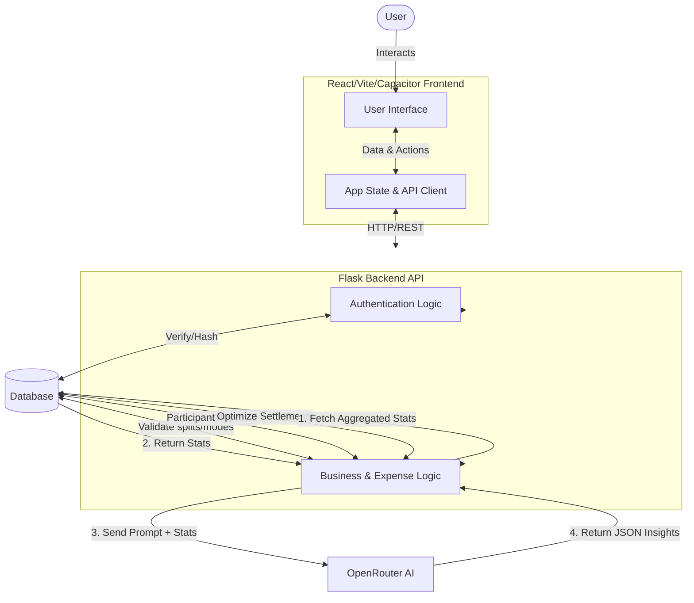
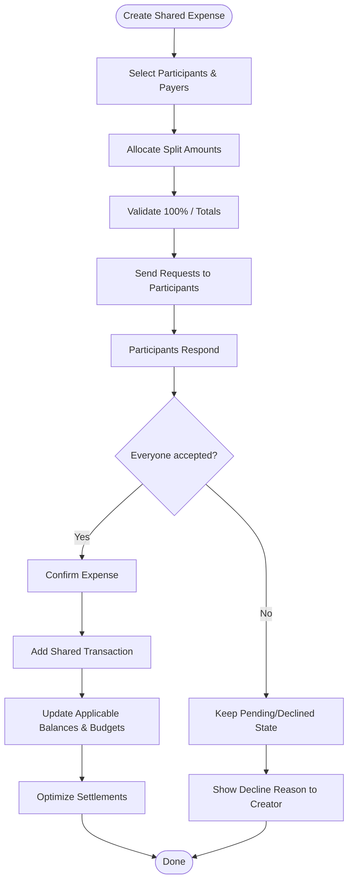

# CampusSpend

CampusSpend is a comprehensive, student-focused personal and shared expense management application. It is designed to help students, hostellers, and friends track their individual expenses, manage monthly budgets, and seamlessly split shared costs without unnecessary friction. By consolidating personal budgeting and group expenses into a single platform, CampusSpend eliminates the need for multiple apps.

Managing finances as a student often involves a mix of personal budgeting and shared costs—such as food bills, auto rides, subscriptions, printouts, and group project expenses. CampusSpend addresses these use cases directly, providing an intuitive interface for both private expense tracking and transparent group settlements.

The application also integrates AI-powered financial insights to help users identify spending patterns and find practical ways to save money based on their actual deterministic transaction data.

## Problem Statement

Students frequently share expenses, but managing them efficiently is a common challenge. Some of the core problems faced include:
- **Uneven Expense Splitting**: Not every shared bill is split equally (e.g., someone ordered a more expensive meal).
- **Multiple Participants**: Coordinating splits among several people can be chaotic.
- **Pending Accept/Decline Requests**: Without a formal request system, users might be charged for expenses they didn't agree to.
- **Tracking Who Owes Whom**: Keeping mental notes or using scattered chat messages leads to forgotten debts and awkward conversations.
- **Budget Tracking**: Shared expenses often bypass personal budgets, leading to inaccurate financial tracking.
- **Maintaining Accurate Records**: Lack of a centralized ledger makes it difficult to review past expenses and settlements.

## Features

- **Personal expense tracking**: Add, edit, and categorize daily personal transactions.
- **Budget management**: Set and monitor overall monthly budgets.
- **Category-based spending**: Categorize expenses to see exactly where money goes.
- **Shared expenses**: Comprehensive shared expense tracking.
- **Group expenses**: Create groups to track shared bills among multiple members.
- **Direct/1-to-1 shared expenses**: Request splits directly with individual users.
- **Uniform expense allocation**: Automatically split expenses equally among participants.
- **Specific Value expense allocation**: Assign precise monetary amounts to specific participants.
- **Ratio/percentage-based allocation**: Assign percentage shares to participants.
- **Real-time unallocated amount tracking**: Visual indicators showing if the split totals match the total expense.
- **Percentage validation with a 100% maximum**: Prevents users from allocating more or less than 100% of an expense.
- **Correct rounding/remainder handling**: Ensures splits add up perfectly to the cent.
- **Multiple payers/contributors**: Support for expenses where multiple people paid different portions of the total bill.
- **Settlement optimization**: Simplifies debts among participants.
- **Minimum transaction path**: Calculates the most efficient way to settle debts between multiple users.
- **Accept/decline workflow**: Participants must explicitly accept a shared expense request.
- **Decline reason visible to relevant participants**: If a user declines a request, they can provide a reason that is visible to others.
- **Shared expense is added to transactions ONLY when all participants accept**: Ensures accurate transaction history.
- **Budget deduction happens ONLY after all required participants accept**: Prevents pending requests from inaccurately draining a user's budget.
- **Settlement tracking**: Keep track of who owes whom and mark balances as paid.
- **AI-powered spending insights**: Generates actionable insights and suggestions based on monthly spending data.
- **Light/Dark mode**: Full UI support for system-preferred theme themes.

## Expense Splitting Logic

CampusSpend implements a strict consensus-based shared expense logic. 

**Example:**
If a user creates a shared expense of ₹2000 and assigns:
- User A: ₹800
- User B: ₹1200

The request enters a **Pending** state and remains there until the required participants respond.

**If any required participant declines:**
- The shared expense remains in a pending/declined state.
- The shared expense is **NOT** added as a completed shared transaction.
- The corresponding shared expense deduction is **NOT** applied to the participants' budgets as if everyone accepted.
- The decline reason is explicitly displayed to the relevant participants so they can resolve the discrepancy.

**If ALL required participants accept:**
- The shared expense becomes confirmed.
- The appropriate transaction records are created for the respective amounts.
- The corresponding budgets and spending amounts are accurately updated for all users involved.

## Tech Stack

### Frontend
- React
- Vite
- TailwindCSS
- Framer Motion
- Lucide React
- React Router
- Axios
- Capacitor

### Backend
- Python
- Flask
- SQLAlchemy
- PostgreSQL / SQLite
- Flask-Migrate
- JWT authentication
- bcrypt

### AI
- OpenRouter API
- Llama 3.3 70B Instruct (Used for generating insights from structured financial data)

## Data Processing / Data Processes

1. **Personal transaction flow**: User enters a new expense via the UI → Frontend sends an API request → Backend validates and processes the data → Database stores the transaction → Dashboard instantly updates.
2. **Budget calculation**: User sets a monthly budget → Personal and confirmed shared transactions are aggregated by month and category → Remaining budget is continuously calculated and displayed.
3. **Shared expense creation**: Expense creator inputs details, selects multiple payers if applicable, and selects participants. 
4. **Expense allocation**: Application validates the selected split mode (Uniform, Specific Value, Ratio), handles rounding, checks against 100% maximum, and tracks unallocated amounts in real-time.
5. **Participant accept/decline workflow**: The request is created in the database as Pending. Each participant receives the request and must review it.
6. **Decline reason handling**: If a participant declines, they must provide a reason. This reason is saved and displayed to the creator to facilitate resolution.
7. **Confirmation only after all required participants accept**: A shared expense officially affects personal budgets and transactions ONLY when all participants have accepted. Pending expenses do not impact financial data.
8. **Balance/settlement calculation**: Once confirmed, the system calculates debts. The settlement optimization engine reduces the debts to the minimum transaction path, simplifying payouts between multiple users.
9. **AI insights flow**: Aggregated financial statistics (total spent, budget limits, category breakdowns) are sent securely to the OpenRouter API. The AI model processes the data to generate deterministic spending insights and savings suggestions, which are returned to the user.

## Data Flow Diagram



## Shared Expense Request Flow



## How to Run

### Prerequisites
- Node.js (v18+)
- Python (v3.9+)
- PostgreSQL (Optional, defaults to SQLite for local development)
- Android Studio (for Android build testing)

### Backend Setup
```bash
# Navigate to the backend API directory
cd api

# Create and activate a virtual environment
python -m venv venv

# Windows
venv\Scripts\activate
# macOS/Linux
source venv/bin/activate

# Install required dependencies
pip install -r requirements.txt

# Configure environment variables (JWT_SECRET, AI_API_KEY, DATABASE_URL)
cp .env.example .env

# Run the Flask server
python run_server.py
```
*The API will start on `http://localhost:5000`.*

### Frontend Setup
```bash
# Open a new terminal in the project root directory
npm install

# Start the development server
npm run dev
```
*The web app will start on `http://localhost:5173`.*

### Android Setup
```bash
# Build the production frontend assets
npm run build

# Sync the assets with the Capacitor Android project
npx cap sync android

# Open Android Studio to build and run the app
npx cap open android
```
*Once Android Studio opens, connect a physical Android device via USB (with USB Debugging enabled) or start a Virtual Device. Click the "Run" button in Android Studio to install and launch the application on the device.*

## Project Structure

```text
CampusSpend/
├── android/             # Capacitor Android project configuration
├── api/                 # Flask backend API
│   ├── routes/          # API endpoints (auth, transactions, budgets, insights)
│   ├── utils/           # Helper functions
│   ├── database.py      # Database initialization
│   ├── index.py         # Main Flask application entry point
│   ├── models.py        # SQLAlchemy database models
│   └── requirements.txt # Python dependencies
├── src/                 # React frontend source code
│   ├── components/      # Reusable UI components
│   ├── pages/           # Application views and screens
│   └── main.jsx         # React application entry point
├── package.json         # Node.js dependencies and scripts
└── README.md            # Project documentation
```

## Security / Data Handling

- **Password Hashing**: User passwords are securely hashed using bcrypt before being stored in the database. Raw passwords are never saved.
- **Authentication**: The application uses JSON Web Tokens (JWT) to secure API endpoints and manage user sessions statelessly.
- **Data Persistence**: A relational database (PostgreSQL in production, SQLite locally) is used to ensure persistent, structured application data with referential integrity.
- **Environment Variables**: Sensitive information like API keys (AI_API_KEY) and JWT secrets are strictly read from environment variables and are NOT committed to version control.

## GDG App Dev Round 2 Relevance

CampusSpend directly fulfills key requirements for the GDG App Dev Round 2 Phase 2 and Phase 3 criteria:
- **Phase 2 (Logic Integration)**: Successfully implements multi-party shared expense splitting, pending/accept/decline workflows, custom percentage validations, optimal settlement routing, and strict constraints that prevent inaccurate budget deductions before full consensus is reached.
- **Phase 3 (AI & Cross-Platform)**: Integrates the OpenRouter API (Llama 3.3) to process deterministic financial data and output meaningful insights without hallucinating core statistics. Deploys seamlessly as a responsive web app and a native Android application using Capacitor.

## Demo

- Web Demo: [Add link]
- Android Demo Video: [Add Google Drive link]

## Future Improvements

- Add email or push notifications for pending shared expense requests.
- Implement recurring expenses for subscriptions and monthly bills.
- Export transaction histories to CSV or PDF for personal record-keeping.
